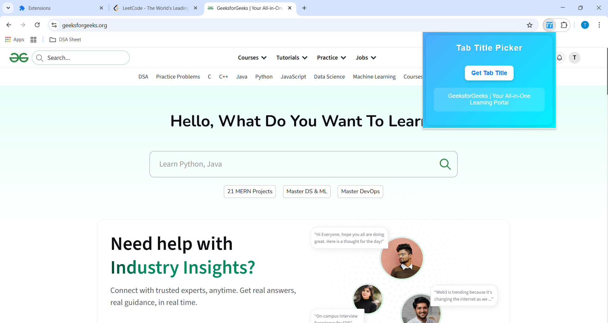

# 🌐 Chrome Tab Title Extension

A sleek Chrome extension that lets you **instantly view the title of your current browser tab** with just one click!  
Built with ❤️ using HTML, CSS, and JavaScript (Manifest v3).

---

## 🚀 Features

- 🖱️ One-click button to fetch the current tab’s title  
- 💎 Clean and modern popup UI  
- ⚡ Instant response — no page reload needed  
- 🌈 Lightweight & built with the latest Chrome Extension API (Manifest v3)

---

## 🧠 How It Works

1. Click on the extension icon (in Chrome toolbar)  
2. A popup appears with a **"Get Tab Title"** button  
3. Click it → The extension instantly shows the **title of the current active tab** inside the popup!

---

## 🛠️ Tech Stack

| Component | Technology |
|------------|-------------|
| Frontend | HTML, CSS, JavaScript |
| Chrome API | Tabs API, Active Tab Permission |
| Manifest | Version 3 |

---

## 📦 Project Structure

tab-title-extension/
├── images
├── app.js
├── background.js
├── index.html
├── manifest.json
├── style.css
├── popup-preview
└── README.md

---

## ⚙️ Installation Guide (for Testing Locally)

1. Clone this repository  
   ```bash
   git clone https://github.com/TejasNere99/Chrome-Tab-Title-Extension.git

---

## 🎨 UI Preview



---

## 🧑‍💻 Author

👤 Tejas Nere

